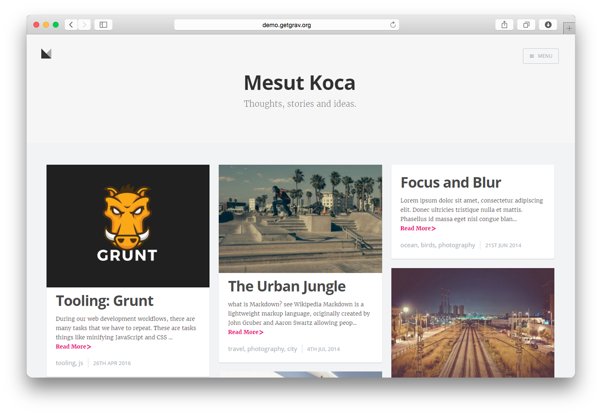

# Masonry Grav Theme



The **Masonry** theme for Grav is a direct port of the [Masonry Theme for Ghost](https://github.com/chris-brown/Masonry-Ghost-Theme) designed by [Chris Brown](http://blog.zirafon.com/about).

# Installation

Installing the Masonry theme can be done in one of two ways. With GPM (Grav Package Manager) installation method enables you to quickly and easily install the theme with a simple terminal command, while the manual method enables you to do so via a zip file.

### GPM Installation (Preferred)

The simplest way to install this theme is via the [Grav Package Manager (GPM)](http://learn.getgrav.org/advanced/grav-gpm) through your system's Terminal (also called the command line).  From the root of your Grav install type:

    bin/gpm install masonry

This will install the Masonry theme into your `/user/themes` directory within Grav. Its files can be found under `/your/site/grav/user/themes/masonry`.

### Manual Installation

To install this theme, just download the zip version of this repository and unzip it under `/your/site/grav/user/themes`. Then, rename the folder to `masonry`.

You should now have all the theme files under

    /your/site/grav/user/themes/masonry

# Dependencies
This theme requires [Pagination](https://github.com/getgrav/grav-plugin-pagination) plugin.
Supports Disqus or [Comments](https://github.com/getgrav/grav-plugin-comments) plugin.
And i highly recommend [Grav Admin](https://github.com/getgrav/grav-plugin-admin) plugin.

# Skeleton
The theme works best in combination with appropriate content and configuration. Please check out the [Mediator Skeleton Package](https://github.com/getgrav/grav-skeleton-mediator-site).

## Pages Hierarchy
`your/site/user/pages` should look like:
```
├── 01.blog (Main folder for blog posts)
│   ├── default.md (blog settings)
|   |── header.jpg (blog cover image if you want to)
|   |
│   ├── post-with-cover (folder for a blog post)
│   │   ├── post.md 
│   │   └── unsplash.jpg
│   ├── tooling-grunt (folder for a blog post)
│   │   └── post.md
|
└── 02.about (Page Folder)
    └── page.md
```

# Configuration

Open the `your/site/user/data/site.yaml` file and add/replace these lines.

```
# Home Page Title
title: 'Mesut Koca · Web Developer'
description: 'Thoughts, stories and ideas.'

author:
  name: 'Mesut Koca'
  email: youremail@domain.com
  # Avatar image optional (under your/site/user/themes/masonry/images/avatar.png)
  image: avatar.png
  # Optional
  link: 'https://twitter.com/twitterusername'
  # Optional
  location: Poland
  # Optional
  bio: 'Type something cool here.'


# Optional
disqus: disqususername
# Optional (under your/site/user/themes/masonry/images/logofile.png)
logo: logofile.png
```

## Blog Settings

Sample `your/site/user/pages/01.blog/default.md` file

```

---
#cover: header.jpg  this is optional...
sitemap:
    changefreq: weekly
    priority: 1.03
content:
    items: '@self.children'
    order:
        by: date
        dir: desc
    limit: 8
    pagination: true
feed:
    description: 'Sample Blog Description'
    limit: 3
pagination: true
---

```
## Cover Image for Blog Home Page

Go to the `your/site/user/pages/01.blog/default.md` file and add this line:

    cover: header.jpg

## Cover Images for Posts

If you want to add cover images to your pages or posts add `image: covername.jpg` to your markdown file. Like so:

```
---
title: 'Tooling: Grunt'
image: yourimagefile.png
---
Lorem ipsum your post....
```

# Updating

As development for the Masonry theme continues, new versions may become available that add additional features and functionality, improve compatibility with newer Grav releases, and generally provide a better user experience. Updating Masonry is easy, and can be done through Grav's GPM system, as well as manually.

## GPM Update (Preferred)

The simplest way to update this theme is via the [Grav Package Manager (GPM)](http://learn.getgrav.org/advanced/grav-gpm). You can do this with this by navigating to the root directory of your Grav install using your system's Terminal (also called command line) and typing the following:

    bin/gpm update masonry

This command will check your Grav install to see if your Masonry theme is due for an update. If a newer release is found, you will be asked whether or not you wish to update. To continue, type `y` and hit enter. The theme will automatically update and clear Grav's cache.

## Manual Update

Manually updating Masonry is pretty simple. Here is what you will need to do to get this done:

* Delete the `your/site/user/themes/masonry` directory.
* Downalod the new version of the Masonry theme from either [GitHub](https://github.com/koca/grav-theme-masonry) or [GetGrav.org](http://getgrav.org/downloads/themes#extras).
* Unzip the zip file in `your/site/user/themes` and rename the resulting folder to `masonry`.
* Clear the Grav cache. The simplest way to do this is by going to the root Grav directory in terminal and typing `bin/grav clear-cache`.

> Note: Any changes you have made to any of the files listed under this directory will also be removed and replaced by the new set. Any files located elsewhere (for example a YAML settings file placed in `user/config/themes`) will remain intact.

# Setup

If you want to set Masonry as the default theme, you can do so by following these steps:

* Navigate to `/your/site/grav/user/config`.
* Open the **system.yaml** file.
* Change the `theme:` setting to `theme: masonry`.
* Save your changes.
* Clear the Grav cache. The simplest way to do this is by going to the root Grav directory in Terminal and typing `bin/grav clear-cache`.

Once this is done, you should be able to see the new theme on the frontend. Keep in mind any customizations made to the previous theme will not be reflected as all of the theme and templating information is now being pulled from the **Masonry** folder.

---

## License

This theme is free and open source software, distributed under the [MIT License](/LICENSE) 
